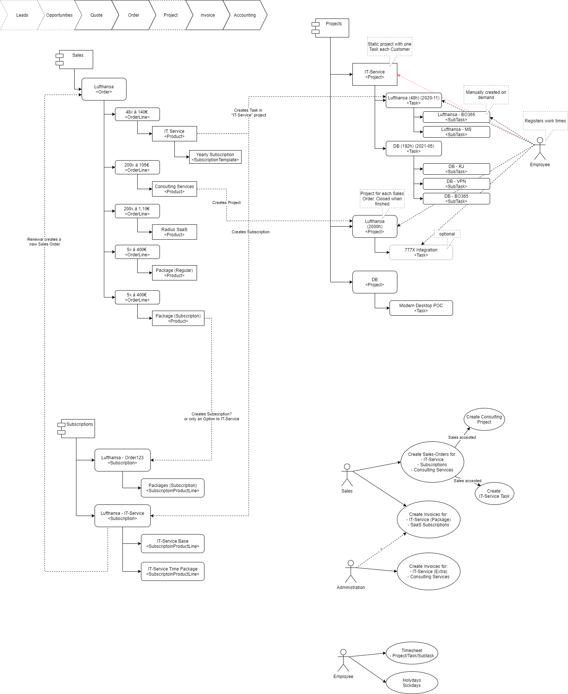

# TODO
* Bank
  * Do we use a payment acquirer
* Employees
  * Location
    * as Work Address
    * as Company
    * as tag
  * Define Attributes
    * Department
    * Job Positions (Status)
    * Sales
  
* Data import
  * Employees
  * Users
  * Contacts
  * Accounts
  * 

# Technical

Logic, Viewes, Config and Data can be loaded by module installation (e.g. SKR03). While Logic and Views should only be changed by Modules, Config and Data is more problematic due to sensitive data. 

## Git
* Public repository 
  * Logic
  * Views 
  * Export templates
* Private repository or UI
  * Settings
    * Microsoft SSO
  * Data 
    * Chart of Accounts 
    * Microsoft authentication 
    * Employees
    * Users
    * 

## TODO:
* Make sure that deleting of documents (invoices) is not possible.

# Business

## List of Products
|Produkt|Workflow|Income Account|Expense Account| 
|-|-|-|-|
|IT-Service|Create Task + Subscription(Y)| 8400 0|-

## Users
* Create Employees
* Link with Contacts
* Link with Users

## Roles
### Administration
* Add Employees
* Add Users to Project
* Create internal Project
* Create company expences
* Create Invoice
  * Based on Timesheets (Cosulting Services)
  * Based on Timesheets (IT-Service volume exceeded)
  * Based on Expences
* Administrate Expences
* Commission -> Payslic

### IT-Service
* Add Users
 

### Sales
* Updates Product Cataloge
* Create Quotations -> Orders 
* Create Invoices
  * Based on Orders
* Renew Subscriptions

### Employees
* Create Times on Tasks and Projects
  * Date, Start, Stop, (Customer/Project/Task), Description
  * At customer flag or expences? (compnany / employee)
* Create Holiday request
* Create Sickday request
* Create Expences
* Lookup Commissions

## Products 
* Define Product Category
  * Saleable
    * Subscription
    * Project
  * Expenses
  * Buyable

  

### Sales
* IT-Service
* Packaging-as-a-Service
  * Organic Individual App
  * Regular Individual App
  * Organic Individual App Update
  * Regular Individual App Update
  * Store App
  * Store App Update
  * Managed App (Subscription)

* AzureVPN-as-a-Service
* Software Provisioning Service
* CSOC included services
* RealmJoin
  * Progressive Pricelist via multiple lines
* Consulting Services
  * (x) Progressive price list 
* Anydesk

## Accounting
### Payment Terms

## Einkauf

# References 
 [link](https://openfellas.com/de/2018/10/)
 
 module-unter-der-openfellas-lupe/
 https://openfellas.com/de/2019/03/datev-vs-integrierte-buchhaltung/